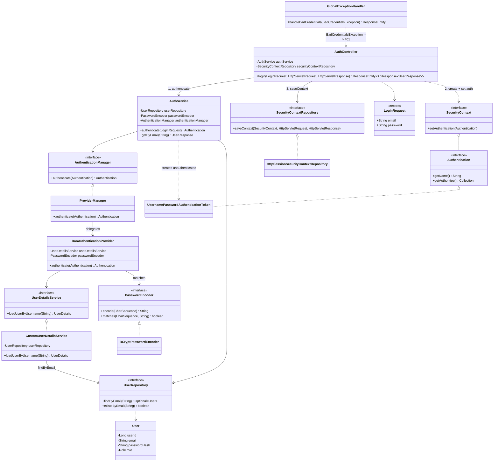

```mermaid
classDiagram
  direction TB

  class AuthController {
    -AuthService authService
    -SecurityContextRepository securityContextRepository
    +login(LoginRequest, HttpServletRequest, HttpServletResponse) ResponseEntity~ApiResponse~UserResponse~~
  }
  
  class AuthService {
    -UserRepository userRepository
    -PasswordEncoder passwordEncoder
    -AuthenticationManager authenticationManager
    +authenticate(LoginRequest) Authentication
    +getByEmail(String) UserResponse
  }
  
  class AuthenticationManager {
    <<interface>>
    +authenticate(Authentication) Authentication
  }
  
  class ProviderManager {
    +authenticate(Authentication) Authentication
  }
  
  class DaoAuthenticationProvider {
    -UserDetailsService userDetailsService
    -PasswordEncoder passwordEncoder
    +authenticate(Authentication) Authentication
  }
  
  class UserDetailsService {
    <<interface>>
    +loadUserByUsername(String) UserDetails
  }
  
  class CustomUserDetailsService {
    -UserRepository userRepository
    +loadUserByUsername(String) UserDetails
  }
  
  class PasswordEncoder {
    <<interface>>
    +encode(CharSequence) String
    +matches(CharSequence, String) boolean
  }
  
  class BCryptPasswordEncoder
  
  class UserRepository {
    <<interface>>
    +findByEmail(String) Optional~User~
    +existsByEmail(String) boolean
  }
  
  class User {
    -Long userId
    -String email
    -String passwordHash
    -Role role
  }
  
  class SecurityContextRepository {
    <<interface>>
    +saveContext(SecurityContext, HttpServletRequest, HttpServletResponse)
  }
  
  class HttpSessionSecurityContextRepository
  
  class SecurityContext {
    <<interface>>
    +setAuthentication(Authentication)
  }
  
  class Authentication {
    <<interface>>
    +getName() String
    +getAuthorities() Collection
  }
  
  class UsernamePasswordAuthenticationToken
  
  class LoginRequest {
    <<record>>
    +String email
    +String password
  }
  
  class GlobalExceptionHandler {
    +handleBadCredentials(BadCredentialsException) ResponseEntity
  }
  
  AuthController --> AuthService : 1. authenticate
  AuthController --> SecurityContextRepository : 3. saveContext
  AuthController ..> LoginRequest
  AuthController ..> SecurityContext : 2. create + set auth
  
  AuthService --> AuthenticationManager
  AuthService ..> UsernamePasswordAuthenticationToken : creates unauthenticated
  AuthService --> UserRepository
  
  AuthenticationManager <|.. ProviderManager
  ProviderManager --> DaoAuthenticationProvider : delegates
  DaoAuthenticationProvider --> UserDetailsService
  DaoAuthenticationProvider --> PasswordEncoder : matches
  
  UserDetailsService <|.. CustomUserDetailsService
  CustomUserDetailsService --> UserRepository : findByEmail
  UserRepository ..> User
  
  PasswordEncoder <|.. BCryptPasswordEncoder
  SecurityContextRepository <|.. HttpSessionSecurityContextRepository
  Authentication <|.. UsernamePasswordAuthenticationToken
  SecurityContext o-- Authentication
  
  GlobalExceptionHandler ..> AuthController : BadCredentialsException --> 401
```
